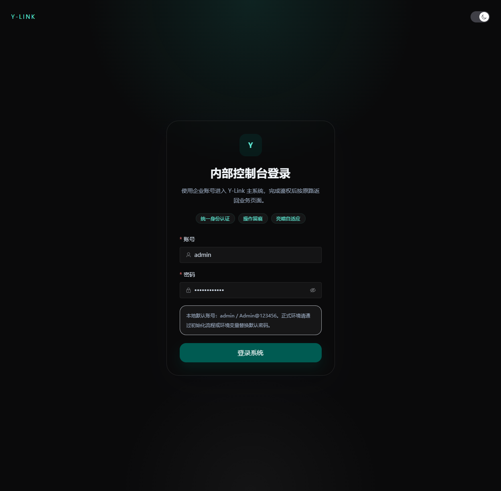

# Y-Link 文创出库管理系统 (EquipTrack)


**Y-Link** 是一套面向文创与非遗行业的现代化出库管理系统，聚焦“开单效率、视觉体验、部署稳定性”。  
前端基于 Vue 3 + TypeScript，后端基于 Express + TypeORM，支持亮暗双主题、键盘流开单、以及 Docker 一体化与云端镜像化部署。

[查看详细开发与部署文档（Wiki）](https://github.com/HF-CYGG/Y-Link/wiki)

---

## 核心特性
- Apple 风格极简 UI，支持丝滑亮暗模式切换。
- 出库开单支持键盘流与实时金额计算，录入效率高。
- 默认 SQLite 零配置启动，同时支持切换 MySQL。
- 内置 Docker Compose 与 GitHub Actions，支持自动构建并推送 Docker Hub。
- 权限、审计链路完善，适合持续迭代的业务系统。

---

## 界面预览
### 登录页


### 工作台


### 出库录入 / 明细


### 系统管理


---

## 快速体验
安装 Docker 后，直接执行：

```bash
docker compose up -d --build
```

启动后访问：
- 前端：`http://127.0.0.1:8080`
- 后端健康检查：`http://127.0.0.1:3001/health`

停止服务：

```bash
docker compose down
```

---

## 技术栈
- 前端：Vue 3、TypeScript、Vite、Pinia、Element Plus、Tailwind CSS
- 后端：Node.js、Express、TypeScript、TypeORM
- 数据库：SQLite（默认）/ MySQL
- 部署：Docker Compose、GitHub Actions、Docker Hub

---

## 文档导航（Wiki）
README 仅保留基础说明，完整开发文档与部署细节统一维护在 Wiki：
- [Home（架构总览）](https://github.com/HF-CYGG/Y-Link/wiki)
- [Developer Guide（本地开发）](https://github.com/HF-CYGG/Y-Link/wiki/Developer-Guide)
- [Deployment（部署指南）](https://github.com/HF-CYGG/Y-Link/wiki/Deployment)
- [GitHub Actions（自动化与 CI/CD）](https://github.com/HF-CYGG/Y-Link/wiki/GitHub-Actions)

---

## License
本项目基于 [MIT License](./LICENSE) 开源，欢迎 Fork 与贡献。
