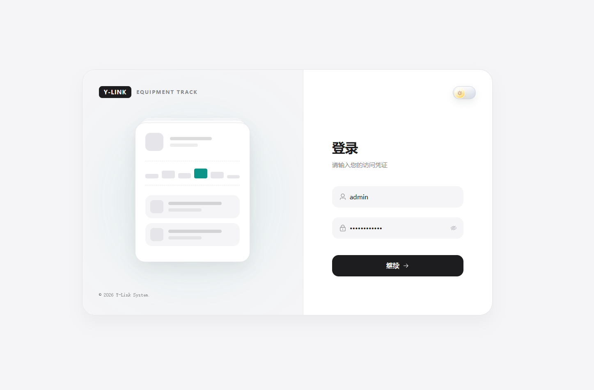
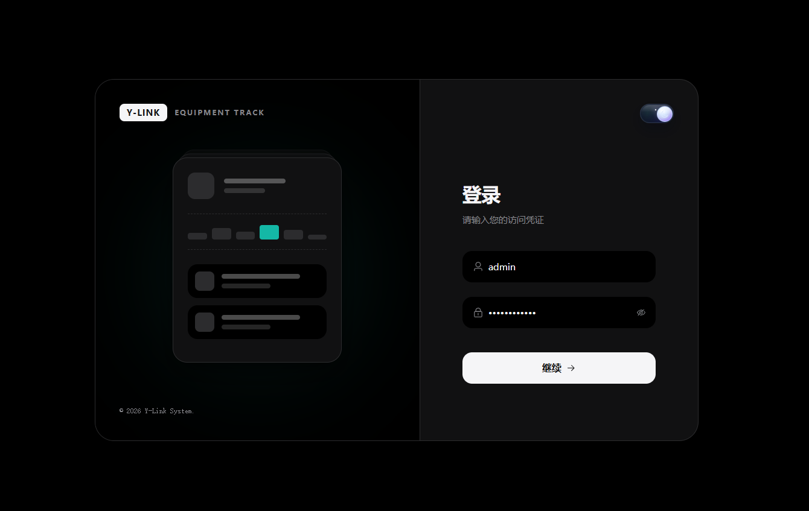
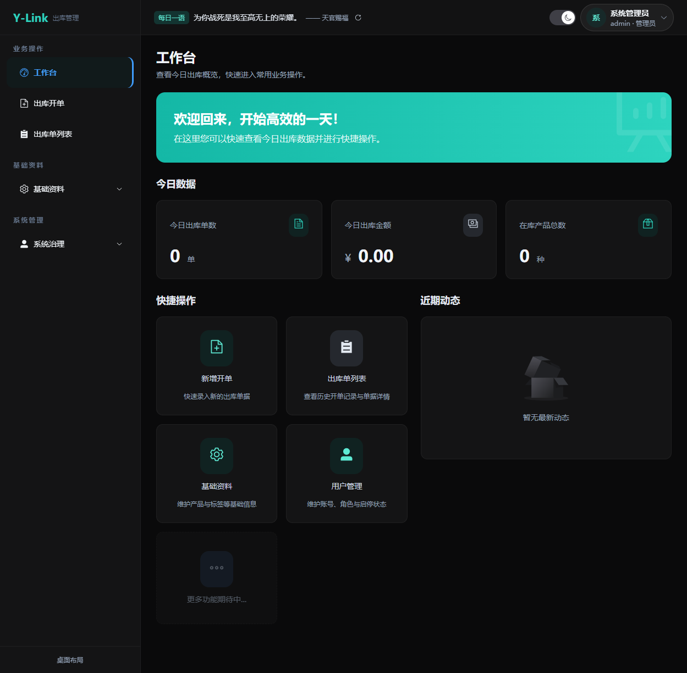
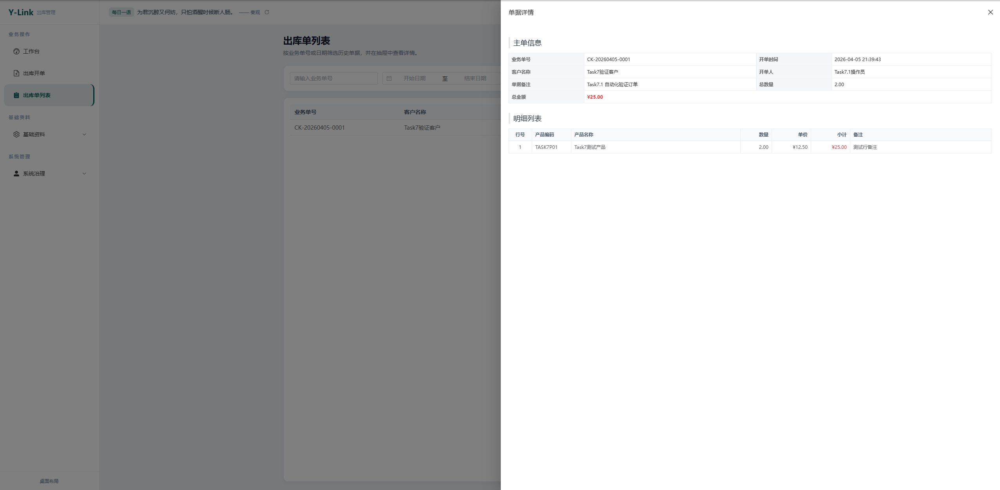
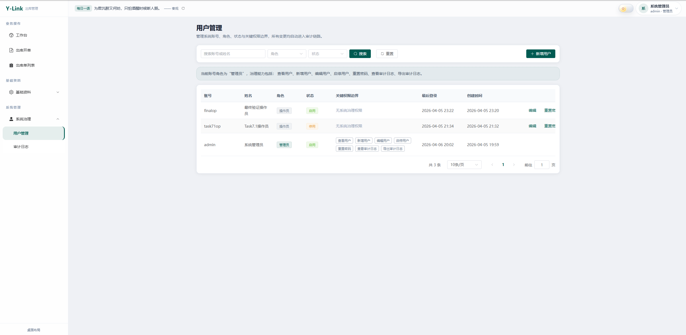

# Y-Link 文创出库管理系统 (EquipTrack)


**Y-Link** 是一套面向文创与非遗行业的现代化出库管理系统，聚焦“开单效率、视觉体验、部署稳定性”。  
前端基于 Vue 3 + TypeScript，后端基于 Express + TypeORM，支持亮暗双主题、键盘流开单、以及 Docker 一体化与云端镜像化部署。

[查看详细开发与部署文档（Wiki）](https://github.com/HF-CYGG/Y-Link/wiki)
[在线查看仓库](https://github.com/HF-CYGG/Y-Link)

---

## 核心特性
- Apple 风格极简 UI，支持丝滑亮暗模式切换。
- 出库开单支持键盘流与实时金额计算，录入效率高。
- 默认 SQLite 零配置启动，同时支持切换 MySQL。
- 内置 Docker Compose 与 GitHub Actions，支持自动构建并双路推送到 Docker Hub 与 GitHub Container Registry (ghcr.io)。
- 权限、审计链路完善，适合持续迭代的业务系统。
- 开单录入支持草稿态保留，临时切页返回后可恢复输入内容。

---

## 界面预览
### 登录页（亮色 / 暗色）



### 工作台


### 出库录入 / 明细


### 系统管理


---

## 快速体验
### Docker 本地构建体验
安装 Docker 后，直接执行：

```bash
docker compose up -d --build
```

启动后访问：
- 前端：`http://127.0.0.1:8080`
- 后端健康检查：`http://127.0.0.1:3001/health`

首次部署（默认 SQLite）时，后端会在启动日志输出初始化管理员账号与密码，便于在 1Panel 日志中直接查看并登录。首次登录后请立即修改密码。

停止服务：

```bash
docker compose down
```

### 1Panel 一键镜像部署（默认 SQLite，可直接使用）
镜像支持双源（Docker Hub / GHCR），推荐国内网络受限时使用 `ghcr.io`：

- 前端：`docker.io/yemiao351/y-link-frontend:latest` 或 `ghcr.io/hf-cygg/y-link-frontend:latest`
- 后端：`docker.io/yemiao351/y-link-backend:latest` 或 `ghcr.io/hf-cygg/y-link-backend:latest`
- 单镜像一键版（前后端同容器）：`docker.io/yemiao351/y-link-onebox:latest` 或 `ghcr.io/hf-cygg/y-link-onebox:latest`

#### 方式 A（优先推荐）：单镜像一键部署（前后端同容器）
如果你希望在 1Panel 里“只填一个镜像就直接可用”，请优先使用（网络受限请将 `docker.io/yemiao351` 替换为 `ghcr.io/hf-cygg`）：

```bash
docker.io/yemiao351/y-link-onebox:latest
```

建议参数：
- 网络：`bridge`
- 端口映射：`宿主机端口 -> 容器 80`（例如 `9050:80`）
- 可选端口：如需直连后端健康检查，可额外映射 `3001:3001`
- 数据持久化（SQLite）：必须把容器目录 `/app/data` 挂载到宿主机目录，否则重建容器后会丢失账号、单据与基础数据。
- 1Panel 填写示例：挂载类型选「本机目录」，`本机目录` 填 `/opt/1panel/apps/y-link/data`，`容器目录` 填 `/app/data`，权限选「读写」。
- 目录建议：请使用固定且可备份的宿主机目录（如 `/opt/1panel/apps/y-link/data`），不要使用临时目录（如 `/tmp`）。
- 生效验证：启动后容器内会生成 SQLite 文件（默认 `y-link.sqlite`），在宿主机挂载目录中应能看到同名文件。
- 迁移注意：更换服务器时只需备份并恢复该挂载目录，即可保留历史业务数据。

重要说明：
- 首次启动会自动初始化管理员账号，并在容器日志打印初始账号密码。
- 登录后请立即修改默认密码，避免生产环境风险。
- `y-link-frontend` 是前端静态站点镜像，单独运行无法提供业务 API；若不用 onebox，请务必同时启动 backend。
- 若访问后出现 “Welcome to nginx!” 而不是登录页：通常是旧容器或旧镜像残留。请删除旧容器后重新 `docker pull docker.io/yemiao351/y-link-onebox:latest` 并重建。

#### 方式 B（进阶）：双容器编排部署（frontend + backend）
如果你在 1Panel 使用容器编排，推荐执行（如果拉取失败，可将 `docker.io/yemiao351` 换为 `ghcr.io/hf-cygg`）：

```bash
docker pull docker.io/yemiao351/y-link-frontend:latest
docker pull docker.io/yemiao351/y-link-backend:latest
docker compose -f compose.cloud.yml pull
docker compose -f compose.cloud.yml up -d
```

在 1Panel「容器编排」页面可按下列方式填写：
- 来源选择：`编辑`
- 编排名称：`y-link`
- 将下方完整 YAML 直接粘贴到编辑器
- 点击创建并启动后，访问 `http://服务器IP:8080`（或你自定义的前端端口）

`compose.cloud.yml` 参考内容（可直接粘贴到 1Panel 编排）：

```yaml
services:
  backend:
    image: ${BACKEND_IMAGE:-docker.io/yemiao351/y-link-backend:latest}
    pull_policy: always
    environment:
      - NODE_ENV=production
      - PORT=3001
      - LOG_COLOR=${LOG_COLOR:-true}
      - FORCE_COLOR=${FORCE_COLOR:-1}
      - DB_TYPE=${DB_TYPE:-sqlite}
      - SQLITE_DB_PATH=${SQLITE_DB_PATH:-/app/data/y-link.sqlite}
      - DB_HOST=${DB_HOST:-127.0.0.1}
      - DB_PORT=${DB_PORT:-3306}
      - DB_USER=${DB_USER:-root}
      - DB_PASSWORD=${DB_PASSWORD:-}
      - DB_NAME=${DB_NAME:-y_link}
      - DB_SYNC=${DB_SYNC:-false}
      - INIT_ADMIN_USERNAME=${INIT_ADMIN_USERNAME:-admin}
      - INIT_ADMIN_DISPLAY_NAME=${INIT_ADMIN_DISPLAY_NAME:-系统管理员}
      - INIT_ADMIN_PASSWORD=${INIT_ADMIN_PASSWORD:-Admin@123456}
    ports:
      - "${BACKEND_PORT:-3001}:3001"
    volumes:
      - y_link_cloud_sqlite_data:/app/data
    healthcheck:
      test:
        - CMD-SHELL
        - wget -q -O /dev/null http://127.0.0.1:3001/health || exit 1
      interval: 10s
      timeout: 5s
      retries: 6
      start_period: 10s
    restart: unless-stopped

  frontend:
    image: ${FRONTEND_IMAGE:-docker.io/yemiao351/y-link-frontend:latest}
    pull_policy: always
    depends_on:
      backend:
        condition: service_healthy
    ports:
      - "${FRONTEND_PORT:-8080}:80"
    healthcheck:
      test:
        - CMD-SHELL
        - wget -q -O /dev/null http://127.0.0.1/ && wget -q -O /dev/null http://127.0.0.1/health || exit 1
      interval: 10s
      timeout: 5s
      retries: 6
      start_period: 5s
    restart: unless-stopped

volumes:
  y_link_cloud_sqlite_data:
```

项目内置一键命令（自动拉起前后端 + 统一日志）：

```bash
npm run cloud:up
```

只看统一日志：

```bash
npm run cloud:logs
```

停止编排：

```bash
npm run cloud:down
```

1Panel 部署注意：
- 推荐使用 **编排 / Compose 项目** 导入 [compose.cloud.yml]，不要只启动单个前端镜像。
- 不要把前端容器设为 `host` 网络，否则容器内 Nginx 会直接占用宿主机 `80` 端口，容易报 `bind() ... 80 failed (98: Address in use)`。
- 正确方式是让前后端一起在同一编排网络启动，由 `frontend -> backend:3001` 自动联动。

特点：
- 不写 `.env` 也可直接启动（默认镜像、默认端口、默认 SQLite）。
- 首次启动会自动初始化管理员，并在容器日志打印账号密码。
- 日志默认开启彩色输出，便于在 1Panel 日志面板快速定位关键信息。
- 前端默认联动同编排后端服务（`backend:3001`），并启用延迟解析，避免启动阶段因 DNS 瞬态异常直接退出。
- 前端健康检查已联动后端可达性（`/health`），后端异常时可在 1Panel 直接看到前端健康状态变更。

### 本地开发（非 Docker）

```bash
npm run local:dev
```

---

## 技术栈
- 前端：Vue 3、TypeScript、Vite、Pinia、Element Plus、Tailwind CSS
- 后端：Node.js、Express、TypeScript、TypeORM
- 数据库：SQLite（默认）/ MySQL
- 部署：Docker Compose、GitHub Actions、Docker Hub

---

## 文档导航（Wiki）
README 仅保留基础说明，完整开发文档与部署细节统一维护在 Wiki：
- [Home（架构总览）](https://github.com/HF-CYGG/Y-Link/wiki)
- [Developer Guide（本地开发）](https://github.com/HF-CYGG/Y-Link/wiki/Developer-Guide)
- [Deployment（部署指南）](https://github.com/HF-CYGG/Y-Link/wiki/Deployment)
- [GitHub Actions（自动化与 CI/CD）](https://github.com/HF-CYGG/Y-Link/wiki/GitHub-Actions)
- [API Reference（接口说明）](https://github.com/HF-CYGG/Y-Link/wiki/API-Reference)
- [Troubleshooting（故障排查）](https://github.com/HF-CYGG/Y-Link/wiki/Troubleshooting)

---

## License
本项目基于 [MIT License](./LICENSE) 开源，欢迎 Fork 与贡献。
