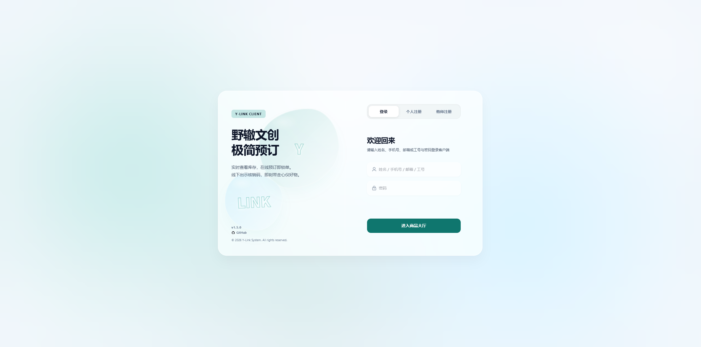
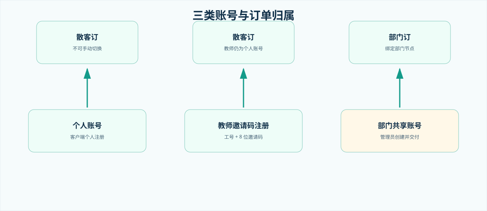
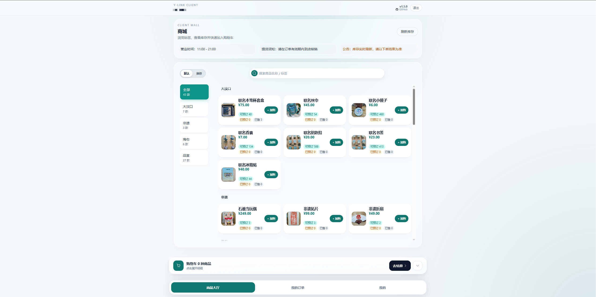
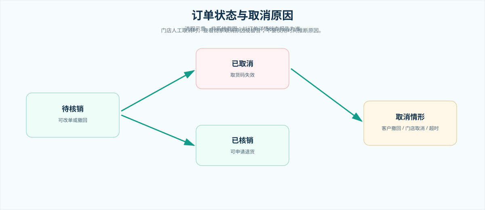
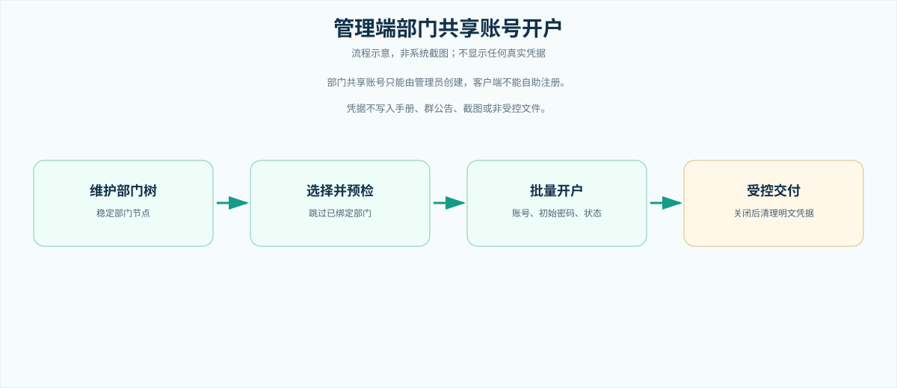

# 野辙文创线上预定系统使用说明

> **手册版本：V1.5.0**\
> **生成日期：2026-09-04**\
> **适用对象：** 客户端用户、部门经办人、门店核销人员、管理员与培训人员。\
> **说明：** 本手册以当前已实现的 Web 客户端、管理端和接口口径为准；示例均为虚构信息，不包含真实账号、手机号、订单号、核销码、二维码或密码。

## 目录

1. 使用前先分清三类账号
2. 客户端登录、注册与找回密码
3. 商品大厅、SKU 与购物车
4. 确认订单与订单归属
5. 订单详情、改单、撤回与取消原因
6. 到店核销、部门正式出库单与退货
7. 反馈与个人中心
8. 管理端：部门共享账号开户
9. 常见问题与培训检查清单

<!-- PAGE_BREAK -->

## 1. 使用前先分清三类账号

系统把“个人身份”和“订单归属”分开处理。客户端没有可手动切换的部门订/散客订开关，订单归属由登录账号决定。

| 账号类型 | 谁创建或注册 | 下单归属 | 资料边界 |
|---|---|---|---|
| 个人账号 | 用户在客户端“个人注册”完成 | 散客订 | 可按页面规则维护个人资料与密码 |
| 教师邀请码注册 | 教师在客户端“教师注册”填写工号与 8 位邀请码 | 散客订 | 姓名、部门、工号以教职工目录核验结果为准 |
| 部门共享账号 | 管理员在管理端创建并交付 | 部门订 | 绑定稳定部门节点；不能由客户端自助注册 |

> **培训提示**：教师邀请码注册是“个人账号的受核验注册方式”，不是部门共享账号。教师和普通个人都按散客订下单；只有管理员创建的部门共享账号才产生部门订。

<!-- PAGE_BREAK -->

## 2. 客户端登录、注册与找回密码

### 2.1 登录

1. 打开客户端登录页。
2. 输入已获授权的账号和密码；账号可为用户名、手机号、邮箱或部门共享账号名。
3. 按页面提示完成图形验证码；验证码是否出现取决于当前安全策略。
4. 成功后进入商品大厅。会话以服务端安全 Cookie 为准，刷新页面后会再次校验登录状态。

不要把密码、验证码、Cookie 或屏幕截图发给他人。部门共享账号的初始密码由管理员通过受控渠道单独交付。

### 2.2 个人注册

在“个人注册”页填写真实姓名、可用登录账号、密码以及页面要求的验证信息。注册完成后即为个人账号，订单按散客订处理。

个人自助注册的用户名会先做 Unicode NFKC 规范化；规范化后仅允许 2–20 位中文汉字或 ASCII 英文字母，可中英混合，禁止空格、数字、标点、表情和其他特殊字符。统一提示必须为“用户名仅支持 2-20 位中文或英文字母，不能包含空格、数字或特殊字符”。

个人自行修改用户名时使用同一规则；历史不合规用户名在未改名时仍可更新联系方式。本条只适用于个人自助注册和个人自行改名，不适用于教师目录姓名、教师邀请码注册或部门共享账号编码。

### 2.3 教师邀请码注册

1. 切换到“教师注册”。
2. 输入工号和管理员一次性告知的 8 位教师邀请码。
3. 系统校验教职工目录中的姓名和部门；核验失败时不要反复尝试，应联系管理员核对目录或重置邀请码。
4. 设置密码并完成验证后登录。

教师邀请码只用于证明教师身份，不会把订单变成部门订。

### 2.4 忘记密码

自助找回仅在管理端同时启用手机和邮箱验证能力时可用。若页面未提供入口、验证码无法送达或账号为部门共享账号，请联系管理员按管理流程处理；不要在聊天工具中发送旧密码。

<!-- PAGE_BREAK -->

## 3. 商品大厅、SKU 与购物车

### 3.1 浏览商品与选择 SKU

商品大厅只展示管理端已上架的线上商品。可使用标签、分类或搜索框定位商品；存在规格时先选择所需 SKU，再确认单价、可预订库存和限购提示。历史订单采用下单时价格快照，后续商品调价不会改写旧订单。

### 3.2 加入购物车

1. 在商品卡点击“加购”，需要时选择 SKU 和数量。
2. 购物车会保存所选商品、价格、库存、限购与勾选状态。
3. 在购物车内勾选本次要结算的商品，可调整数量、删除选中项或处理库存失效项。
4. 点击“去结算”。若目录已刷新，系统会重新核对库存和价格。

> **注意**：商品显示的“可预订”数量已考虑预订单占用。结算页再次校验失败时，以最新提示为准，不要通过连续提交绕过限制。

<!-- PAGE_BREAK -->

## 4. 确认订单与订单归属

结算页会展示商品明细、金额、提货信息和备注。请在提交前核对：商品/SKU、数量、提货联系人、电话和备注。提交成功后，系统占用预订库存并生成取货凭证。

| 登录账号 | 结算页订单归属 | 是否可手动修改 |
|---|---|---|
| 个人账号 | 散客订 | 不可修改 |
| 教师邀请码注册的个人账号 | 散客订 | 不可修改 |
| 部门共享账号 | 部门订 | 不可修改 |

部门订会固化下单时的部门快照；散客订不需要工号。请勿用个人或教师账号代替部门共享账号下单，也不要借用不属于本部门的共享账号。

### 4.1 提交成功后

系统通常跳转到订单详情。请先确认订单状态为“待核销”，并查看取货码/二维码、订单进度、商家特殊状态和商家留言。取货码只能在有效订单中使用。

<!-- PAGE_BREAK -->

## 5. 订单详情、改单、撤回与取消原因

订单详情是取货凭证、进度中心和售后入口。页面会显示订单归属、状态、商品明细、取货码、商家留言和可执行操作。

### 5.1 待核销订单：改单或撤回

仅订单本人可在待核销且无退货申请时操作：

| 操作 | 当前规则 | 结果 |
|---|---|---|
| 修改订单 | 最多成功修改 3 次；可增减商品、删除商品、调整备注 | 重新校验库存；取货码沿用 |
| 撤回订单 | 仅未核销订单可撤回 | 订单关闭，预订库存释放，取货码失效 |

若页面提示修改次数已用完、已核销、已超时或存在退货申请，应按提示联系门店，而不是重复提交。

### 5.2 已取消不等于只有“超时”

订单已取消可能是：客户主动撤回、门店/管理端人工取消，或系统超时取消。客户端订单详情以服务端 `statusReport` 为准显示取消情形；商家人工取消时，页面应查看并保留门店给出的取消原因/留言。商家特殊状态只补充进度，不能替代主状态。

<!-- PAGE_BREAK -->

## 6. 到店核销、部门正式出库单与退货

### 6.1 到店核销

待核销订单到店后，向门店出示订单详情中的二维码、取货码或订单信息。门店在管理端核销后，订单变为“已核销”，系统扣减现货库存并生成关联的正式出库记录。

### 6.2 部门正式出库单

只有部门共享账号形成的部门订，订单详情才显示正式出库单入口。打开后可预览、打印或导出 PDF；触发打印/导出会记录“已触发正式出库单”的合规状态。散客订不显示该入口。

建议部门经办人在取货前核对部门、提货人和单据内容；如现场另有纸质交接要求，以门店规定为准。不要在培训材料、群聊或非受控文件中传播订单二维码或真实单号。

### 6.3 已核销后申请退货

退货入口只在已核销订单出现：

1. 选择需退商品和数量，填写退货原因。
2. 提交后页面显示退货记录和退货码/二维码。
3. 携带商品到店，由门店核销退货。
4. 结果可能为待门店核销、退货已完成或退货已拒绝；被拒绝时查看原因。

待核销阶段不要申请退货；若不再需要商品，应使用“撤回订单”。

<!-- PAGE_BREAK -->

## 7. 反馈与个人中心

### 7.1 反馈

在“我的”进入反馈与客服，可新建会话、补充消息、查看客服回复、确认解决或在允许时撤回会话。反馈会话仅限本人查看；不要上传密码、验证码、完整订单二维码或其他敏感信息。

### 7.2 个人中心

个人中心用于查看身份资料、维护可修改联系方式和修改密码。个人账号可按页面规则修改个人资料；教师账号的工号、姓名和部门来自目录核验，不应在客户端改写；部门共享账号的部门归属由管理端治理。

退出登录或在共用设备换号后，系统会清理用户相关缓存。公共终端使用完毕务必退出。

<!-- PAGE_BREAK -->

## 8. 管理端：部门共享账号开户（管理员）

### 8.1 权限与前置条件

部门共享账号只能由拥有客户端用户治理相关权限的管理员在管理端创建。先在系统配置中维护稳定的部门树；一个已启用共享账号只能绑定一个部门节点，部门删除或改名会受到绑定关系保护。

### 8.2 批量开户步骤

1. 进入“系统管理 - 客户端用户管理”。
2. 打开“部门共享账号批量开户”，勾选要开户的部门节点。
3. 先执行预检：系统返回可创建项，并跳过已绑定账号的部门。
4. 为每个可创建部门指定账号名、初始密码和启用状态，确认部门归属无误。
5. 提交创建；仅将本次返回的账号凭据通过受控渠道交付给部门经办人。
6. 关闭弹窗后，页面会清理明文凭据和下载链接；如需后续处理，应走管理员重置密码流程。

> **禁止事项**：不要让部门在客户端自助注册共享账号；不要把初始密码写入本手册、工单正文、群公告或截图；不要批量删除仍有关联订单、出库单或退货记录的订单数据。

<!-- PAGE_BREAK -->

## 9. 常见问题与培训检查清单

### 9.1 常见问题

| 问题 | 先这样处理 |
|---|---|
| 看不到“教师注册”或验证码 | 刷新页面；确认后端验证码能力配置；仍失败时联系管理员 |
| 教师邀请码无效 | 核对工号与 8 位邀请码；不要猜码或重复尝试；请管理员核验目录与邀请码状态 |
| 想代表部门下单 | 使用管理员交付的部门共享账号；个人/教师账号仍为散客订 |
| 无法撤回订单 | 订单可能已核销、已取消、已超时或已有退货申请；查看订单详情状态 |
| 看不到正式出库单 | 仅部门订显示；确认当前登录的是部门共享账号且订单归属为部门订 |
| 商家取消了订单 | 查看取消情形、商家取消原因/留言和订单进度；需要补充说明时发起反馈 |
| 无法申请退货 | 仅已核销订单可申请；待核销请使用撤回订单 |

### 9.2 培训前检查

- 使用虚构账号演示，不展示真实密码、手机号、订单号、二维码或 Cookie。
- 演示个人、教师、部门共享账号各自的边界，并强调教师不是部门订。
- 演示加购、结算、订单详情、撤回和退货入口的不同触发条件。
- 由管理员演示部门共享账号预检、开户和受控交付，避免录屏保留明文凭据。
- 如遇页面与本手册不一致，以当前系统提示和管理员公告为准，并记录后修订本手册。

## 附：当前界面与流程素材说明

图 1、图 3 为仓库内经核验的已脱敏当前客户端界面素材；图 2、图 4、图 5 是仅表达业务路径的脱敏流程示意，不表示真实系统数据或实时界面状态。
